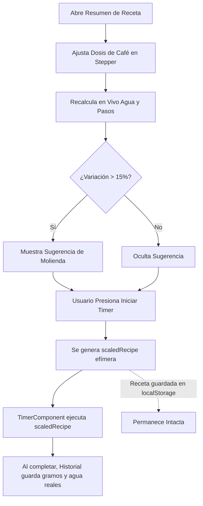

# 📋 Especificación Funcional y de UI/UX: Calculadora Dinámica de Ratios

**Proyecto:** Barista Timer PWA  
**Feature:** Calculadora Dinámica de Ratios y Escalado de Recetas  
**Estado:** Especificación Lista para Aprobación e Implementación  
**Versión Objetivo:** `1.17.0`  

---

## 1. 🎯 Objetivo y Declaración del Problema

### 1.1. Problema
Actualmente, las recetas en Barista Timer cuentan con una dosis fija de café (`coffee_g`) y cantidades fijas de agua por cada paso. Cuando un usuario desea:
1. Preparar una cantidad diferente para más personas (ej. pasar de una dosis individual de 15g a 30g).
2. Adaptar la receta a una taza pequeña o a la capacidad de su portafiltro/cono (ej. 12g o 18g).
3. Utilizar exactamente la cantidad de granos que le quedan en su bolsa (ej. 16.5g).

El usuario se ve obligado a calcular mentalmente la regla de tres para cada vertido o a crear/editar manualmente una nueva receta en el catálogo, lo que genera fricción innecesaria y desincentiva la experimentación.

### 1.2. Objetivo
Permitir al usuario **modificar dinámicamente la dosis de café en la vista previa previa al cronómetro (`RecipeSummaryModal`)**, de modo que la aplicación:
1. **Recalcule y escale proporcionalmente** el agua total y el agua asignada a cada paso de la receta manteniendo el **ratio original ($1:X$)**.
2. **Mantenga fijos** la temperatura del agua y los tiempos programados de cada paso.
3. **Ofrezca sugerencias baristas inteligentes sobre la molienda (*Grind Size*)**, alertando al usuario si el cambio de dosis altera significativamente la resistencia hidráulica de la cama de café (evitando sobreextracción o subextracción).
4. **Preserve intacta la receta original en el almacenamiento local**, transfiriendo la configuración escalada únicamente a la sesión del temporizador y al posterior registro en el historial.

---

## 2. ☕ Fundamentos Baristas y Físico-Químicos

### 2.1. Conservación del Ratio ($1:X$) y Temperatura
* **Ratio:** Representa la relación masa de café a masa de agua. Define la concentración teórica (*TDS*) y el balance sensorial buscado por el autor de la receta. Al escalar, el ratio debe permanecer invariante.
* **Temperatura:** La temperatura óptima de extracción responde a la densidad del grano, variedad y nivel de tueste, no al volumen preparado. Mantener los °C intactos es el estándar técnico de la SCA (*Specialty Coffee Association*).

### 2.2. Ley de Darcy, Altura de la Cama y Molienda
Al aumentar o disminuir la masa de café en un método por goteo (V60, Chemex, Kalita, Origami):
* **Aumento de dosis (+):** La cama de café se vuelve más profunda. El agua experimenta mayor resistencia al flujo por gravedad. Si no se modifica la molienda, el tiempo de contacto (*drawdown time*) se alarga excesivamente, causando sobreextracción (amargor, astringencia, sequedad).
  * *Acción barista requerida:* **Moler más grueso (*coarser*)**.
* **Disminución de dosis (-):** La cama de café es más delgada, la resistencia hidráulica cae y el agua drena velozmente, causando subextracción (acidez punzante, cuerpo aguado).
  * *Acción barista requerida:* **Moler más fino (*finer*)**.

### 2.3. Tiempos de los Pasos (`duration_s`)
No se deben forzar algoritmos arbitrarios que alteren la duración programada de los pasos en el temporizador:
* El tiempo de preinfusión (*bloom*) responde a la desgasificación del $CO_2$, no requiriendo multiplicar el tiempo linealmente.
* Al ajustar la molienda en el molino físico, el barista compensa la resistencia hidráulica y permite que el flujo de agua respete la cadencia natural de los pasos de la receta.

---

## 3. 📐 Algoritmo Matemático de Escalado

### 3.1. Factor de Escala
Sea:
* $C_{\text{orig}}$: Dosis original de café en gramos (`recipe.coffee_g`).
* $C_{\text{nuevo}}$: Dosis objetivo introducida por el usuario ($5 \le C_{\text{nuevo}} \le 100$).
* $W_{\text{orig}}$: Agua total original $\sum w_i$.

El factor de escala adimensional es:
$$S = \frac{C_{\text{nuevo}}}{C_{\text{orig}}}$$

### 3.2. Agua Total y Agua por Paso
1. **Agua total escalada:**
   $$W_{\text{nuevo}} = \text{round}(W_{\text{orig}} \times S)$$
2. **Agua por cada paso $i$:**
   * Si $w_i == 0$ (pasos de reposo, agitar, revolver, prensar):
     $$w'_{i} = 0$$
   * Si $w_i > 0$:
     $$w'_{i} = \text{round}(w_i \times S)$$
3. **Ajuste de Discrepancia por Redondeo:**
   Debido a los redondeos independientes a números enteros, puede ocurrir que $\sum w'_i \neq W_{\text{nuevo}}$ (típicamente $\pm 1\text{g}$).
   * Sea la diferencia $D = W_{\text{nuevo}} - \sum w'_i$.
   * Si $D \neq 0$, se suma $D$ al **último paso con agua ($w'_i > 0$)** de la receta.
   * Esto garantiza con total precisión que la suma de los pasos individuales coincida siempre con el agua total acumulada.

---

## 4. 🧠 Reglas de Sugerencia de Ajuste de Molienda

Definimos la variación porcentual de dosis:
$$\Delta = \frac{C_{\text{nuevo}} - C_{\text{orig}}}{C_{\text{orig}}}$$

| Condición | Rango de Variación | Tipo de Mensaje | Recomendación al Barista |
|---|---|---|---|
| $|\Delta| < 0.15$ | Entre $-15\%$ y $+15\%$ | Neutro / Sin alerta | Tolerancia habitual de la receta; no requiere ajuste de molienda. |
| $+0.15 \le \Delta \le +0.35$ | Aumento de $+15\%$ a $+35\%$ | Sugerencia moderada (💡) | *"Dosis mayor (+X%): Considera usar 1–2 clics más grueso en tu molino para evitar sobreextracción."* |
| $\Delta > +0.35$ | Aumento mayor a $+35\%$ | Advertencia notable (⚠️) | *"Dosis significativamente mayor (+X%): Muele claramente más grueso para permitir un drenaje fluido y evitar canalizaciones."* |
| $\Delta \le -0.15$ | Disminución de $-15\%$ o más | Sugerencia moderada (💡) | *"Dosis menor (-X%): Considera moler un poco más fino para generar resistencia y mantener cuerpo y balance."* |

---

## 5. 🎨 Especificación de UI/UX en `RecipeSummaryModal`

### 5.1. Control de Dosis en Parámetros Físicos
En la tarjeta superior de parámetros físicos del modal:

```text
┌───────────────────────────────────────────────────────────┐
│ CAFÉ (DOSIS)                             TEMPERATURA     │
│ ┌───┐ ┌────────┐ ┌───┐ [↺ Reset]                         │
│ │ - │ │  20 g  │ │ + │                     92°C          │
│ └───┘ └────────┘ └───┘                                    │
│                                                           │
│ ───────────────────────────────────────────────────────── │
│ PROPORCIÓN                                 Ratio 1:16.7   │
│ Agua total: 334g (original 250g)                          │
└───────────────────────────────────────────────────────────┘
```

#### Controles y Comportamiento:
1. **Selector Stepper:**
   * Botón decrementar (`-`): resta 1g (límite inferior: 5g). Deshabilitado si llega a 5g.
   * Input numérico directo: permite teclear cualquier número entre 5 y 100.
   * Botón incrementar (`+`): suma 1g (límite superior: 100g). Deshabilitado si llega a 100g.
2. **Botón de Restablecimiento (`↺` / `Reset`):**
   * Visible únicamente cuando la dosis actual difiere de la dosis original de la receta (`customCoffeeG !== summaryRecipe.coffee_g`).
   * Al hacer clic, restaura la dosis original instantáneamente.
3. **Indicador de Agua Total Actualizada:**
   * Muestra la nueva cantidad de agua total calculada. Si la dosis cambió, muestra un texto sutil indicando el agua original (ej. *(orig. 250g)*).
4. **Banner de Sugerencia de Molienda:**
   * Si la variación supera el umbral del $\pm 15\%$, aparece un contenedor suavemente animado debajo de la tarjeta de parámetros con fondo ámbar/azul suave e iconografía descriptiva.
5. **Lista de Pasos:**
   * Los valores `+Xg` en cada paso se actualizan en tiempo real reflejando la porción escalada de agua.

---

## 6. 🔄 Flujo de Navegación, Timer e Historial



1. **Efimeridad:** `summaryRecipe` original no se modifica en `localStorage`.
2. **Timer:** `onStartTimer(scaledRecipe)` transmite la copia con `coffee_g` y `steps` adaptados.
3. **Historial:** Al completarse el temporizador, el registro guardado reflejará la dosis real consumida (`scaledRecipe.coffee_g` y su agua total).

---

## 7. ♿ Accesibilidad y Buenas Prácticas
* Todos los botones (`-`, `+`, `Reset`) deben incluir atributos `aria-label` claros (ej. `"Disminuir dosis de café"`, `"Aumentar dosis de café"`, `"Restablecer dosis original"`).
* Los inputs numéricos deben contar con `min="5"` y `max="100"`.
* En modo oscuro, los colores de los banners y botones deben cumplir con un contraste mínimo WCAG AA (ratio ≥ 4.5:1).
* Iconos en SVG reutilizables sin emojis hardcodeados.
